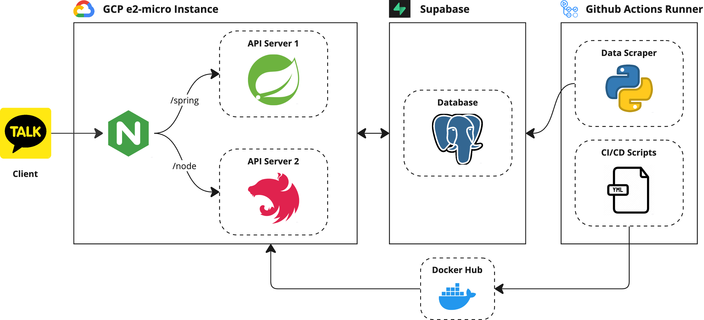

## 커넥트 지누

경상국립대 학생들을 위한 교내 정보 제공 카카오톡 챗봇 서비스

## 프로젝트 기능 소개

  <h3>학교 & 학과 공지사항 조회</h3>

  <h3>학식 메뉴 조회</h3>

  <h3>학사일정</h3>

  <h3>셔틀버스</h3>

  <h3>열람실 좌석</h3>

## ⚙️ 프로젝트 구조

### 시스템 아키텍처

### 기술 스택

## 🐾 팀원 소개

|  |  |  |  |  |
| :----------------------------------------------------------------------------------------: | :-----------------------------------------------------------------------------------------: | :----------------------------------------------------------------------------------------: | :-----------------------------------------------------------------------------------------: | :-----------------------------------------------------------------------------------------: |
|                Dongho Jang [@JangDongHo](https://github.com/JangDongHo)                |                     hykim02 [@hykim02](https://github.com/hykim02)                      |                hayeonkang [@hayeonkang](https://github.com/hayeonkang)                 |                          [@brainVRG](https://github.com/brainVRG)                           |                                          @minseob                                           |

[Table made by TIT](https://team-info-table.seondal.kr/)
